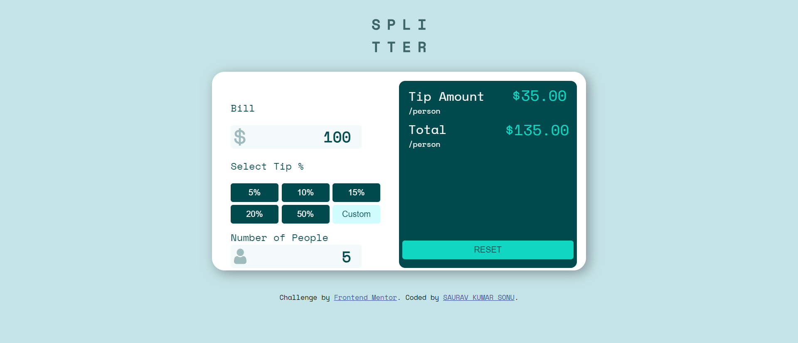

# Frontend Mentor - Tip calculator app solution

This is a solution to the [Tip calculator app challenge on Frontend Mentor](https://www.frontendmentor.io/challenges/tip-calculator-app-ugJNGbJUX). Frontend Mentor challenges help you improve your coding skills by building realistic projects.

## Table of contents

- [Overview](#overview)
  - [The challenge](#the-challenge)
  - [Screenshot](#screenshot)
  - [Links](#links)
- [My process](#my-process)
  - [Built with](#built-with)
  - [What I learned](#what-i-learned)
  - [Useful resources](#useful-resources)
- [Author](#author)

## Overview

### The challenge

Users should be able to:

- View the optimal layout for the app depending on their device's screen size
- See hover states for all interactive elements on the page
- Calculate the correct tip and total cost of the bill per person

### Screenshot

### Links

- Solution URL: [GITHUB](https://github.com/ItsmeSauravSonu/tip-calculator-app-main)
- Live Site URL: [NETLIFY](https://tip-calculator-sks.netlify.app/)

## My process

### Built with

- Semantic HTML5 markup
- CSS custom properties
- Flexbox
- CSS Grid
- Mobile-first workflow

### What I learned

I learnt some basic JS things like DOM manipulation and also learnt css a lot mostly css grid.

### Useful resources

- [ Resource 1](https://www.w3schools.com/js/) - This helped me for writing JS code reason. I really liked the way they have documented.
- [ Resource 2](https://stackoverflow.com/) - For fixing some issues and get extra resources.
-[ Resource 3](https://css-tricks.com/snippets/css/complete-guide-grid/) - Best resource for learning css grid

## Author

- Website - [SAURAV KUMAR SONU](https://www.linkedin.com/in/sauravsonu/)
- Frontend Mentor - [@ItsmeSauravSonu](https://www.frontendmentor.io/profile/ItsmeSauravSonu)
- Twitter - [@saurav_s07](https://rb.gy/0tkam0)

